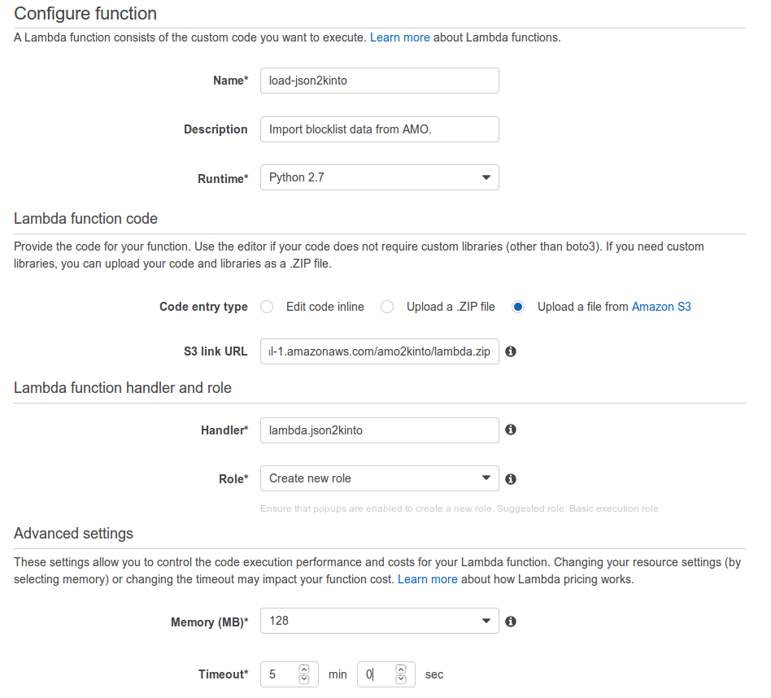
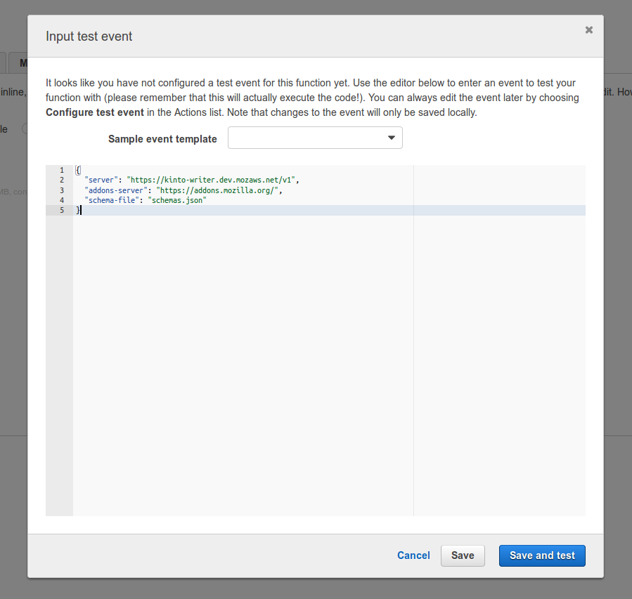
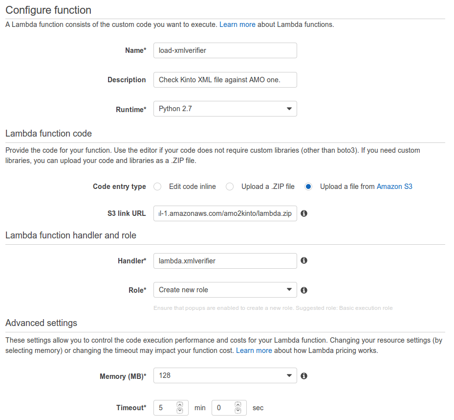
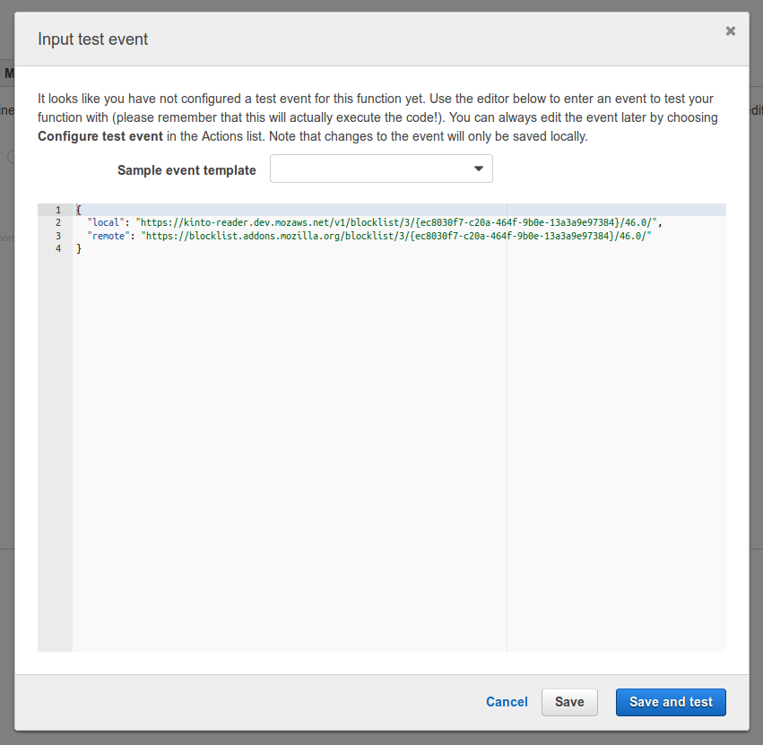
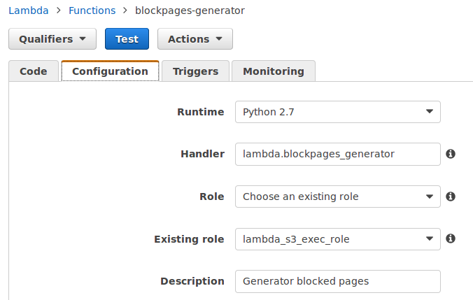
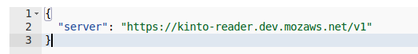

Usage
=====

How to use this project?
------------------------

1. Build a zip or use `the one from the last release <https://github.com/mozilla-services/amo2kinto-lambda/releases>`_
2. Upload the zip in a S3 bucket
3. Copy the S3 zip URL
4. Create a ``json2kinto`` Amazon Lambda function and paste the S3 zip URL
5. Create a ``xml-verifier`` Amazon Lambda function and paste the S3 zip URL
6. Configure a Cloud Watch alert that sends an email in case of error
7. Configure a Cloud Watch schedule tasks that run ``json2kinto`` every 30 minutes
8. Wait for json2kinto to run once
9. Configure a Cloud Watch schedule tasks that run ``xml-verifier`` every 30 minutes

How to build the last version of the zip?
-----------------------------------------

.. note::
   You need to run this project on a ``x86_64`` linux architecture. 
   
   It's highly recommended to use Lambda's execution environment and work within a Lambda AMI. 
   See http://docs.aws.amazon.com/lambda/latest/dg/current-supported-versions.html

To build the zip run: ``make zip``

It will create a ``lambda.zip`` file ready to use.

You can upload it in a S3 bucket to then access it from Amazon Lambda.

How to create the ``json2kinto`` function on Amazon Lambda?
-----------------------------------------------------------

1. `Log into the Amazon Web Service console. <https://console.aws.amazon.com/lambda/home>`_
2. Click the **Create a Lambda Function** button
3. Skip the blueprint
4. Configure the function: **name**, **description**
5. Select **Python 2.7** runtime
6. Select **Upload a file from Amazon S3**
7. Enter the S3 URL where the ``lambda.zip`` was uploaded
8. Use **lambda.json2kinto** handler
9. Set a **Basic Execution Role**
10. Configure a 5 minutes timeout
11. Configure the Virtual Private Cloud (VPC) in order to give network access to
    the destination Kinto instance (e.g ``kinto-writer``)

How to run the ``json2kinto`` function on Amazon Lambda?
--------------------------------------------------------

Once your function has been configured, you can run it.

To do that, select the function and in the **Actions** menu select
**Configure Test event**.

You will then be able to enter a **Input test event** as a JSON.

You can use any ``json2kinto`` available option without the ``--`` as
a key and the value as a parameter:

.. code-block:: json

    {
      "server": "https://kinto-writer.stage.mozaws.net/v1",
      "addons-server": "https://addons.mozilla.org/",
      "schema-file": "schemas.json"
    }

The ``schema-file`` is the one present in the ``lambda.zip`` file.

Here are the available options:

.. code-block::shell

   usage: json2kinto [-h] [-s SERVER] [-a AUTH] [-v] [-q] [-D] [-S SCHEMA_FILE]
                      [--no-schema] [--certificates-bucket CERTIFICATES_BUCKET]
                      [--certificates-collection CERTIFICATES_COLLECTION]
                      [--gfx-bucket GFX_BUCKET] [--gfx-collection GFX_COLLECTION]
                      [--addons-bucket ADDONS_BUCKET]
                      [--addons-collection ADDONS_COLLECTION]
                      [--plugins-bucket PLUGINS_BUCKET]
                      [--plugins-collection PLUGINS_COLLECTION] [-C] [-G] [-A]
                      [-P] [--addons-server ADDONS_SERVER]

    Import the blocklists from the addons server into Kinto.

    optional arguments:
      -h, --help            show this help message and exit
      -s SERVER, --server SERVER
                            The location of the remote server (with prefix)
      -a AUTH, --auth AUTH  BasicAuth token:my-secret
      -v, --verbose         Show all messages.
      -q, --quiet           Show only critical errors.
      -D, --debug           Show all messages, including debug messages.
      -S SCHEMA_FILE, --schema-file SCHEMA_FILE
                            JSON Schemas file
      --no-schema           Should we handle schemas
      --certificates-bucket CERTIFICATES_BUCKET
                            Bucket name for certificates
      --certificates-collection CERTIFICATES_COLLECTION
                            Collection name for certificates
      --gfx-bucket GFX_BUCKET
                            Bucket name for gfx
      --gfx-collection GFX_COLLECTION
                            Collection name for gfx
      --addons-bucket ADDONS_BUCKET
                            Bucket name for addons
      --addons-collection ADDONS_COLLECTION
                            Collection name for addon
      --plugins-bucket PLUGINS_BUCKET
                            Bucket name for plugins
      --plugins-collection PLUGINS_COLLECTION
                            Collection name for plugin
      -C, --certificates    Only import certificates
      -G, --gfx             Only import GFX drivers
      -A, --addons          Only import addons
      -P, --plugins         Only import plugins
      --addons-server ADDONS_SERVER
                            The addons server to import from

How to create the ``xml-verifier`` function on Amazon Lambda?
-------------------------------------------------------------

1. `Log into the Amazon Web Service console. <https://console.aws.amazon.com/lambda/home>`_
2. Click the **Create a Lambda Function** button
3. Skip the blueprint
4. Configure the function: **name**, **description**
5. Select **Python 2.7** runtime
6. Select **Upload a file from Amazon S3**
7. Enter your S3 ``lambda.zip`` URL
8. Use **lambda.xmlverifier** handler
9. Set a **Basic Execution Role**
10. Configure a 5 minutes timeout
11. You can proceed without a VPC

How to run the ``xml-verifier`` function on Amazon Lambda?
----------------------------------------------------------

Once your function has been configured, you can run it.

To do that, select the function and in the **Actions** menu select
**Configure Test event**.

You will then be able to enter a **Input test event** as a JSON.

The ``xml-verifier`` let you define two input: ``local`` and
``remote``, you should configure the XML URL from Kinto in ``local`` and
the XML URL from Addons Server in ``remote``:

.. code-block:: json

    {
      "local": "https://kinto.stage.mozaws.net/v1/blocklist/3/{ec8030f7-c20a-464f-9b0e-13a3a9e97384}/46.0/",
      "remote": "https://blocklist.addons.mozilla.org/blocklist/3/{ec8030f7-c20a-464f-9b0e-13a3a9e97384}/46.0/"
    }

How to create the ``blockpages-generator`` function on Amazon Lambda?
---------------------------------------------------------------------

1. `Log into the Amazon Web Service console. <https://console.aws.amazon.com/lambda/home>`_
2. Click the **Create a Lambda Function** button
3. Skip the blueprint
4. Configure the function: **name**, **description**
5. Select **Python 2.7** runtime
6. Select **Upload a file from Amazon S3**
7. Enter your S3 ``lambda.zip`` URL
8. Use **lambda.blockpages_generator** handler
9. Set a **Lambda S3 Exec Role**
10. Configure a 5 minutes timeout
11. You can proceed without a VPC

How to run the ``blockpages-generator`` function on Amazon Lambda?
------------------------------------------------------------------

Once your function has been configured, you can run it.

To do that, select the function and in the **Actions** menu select
**Configure Test event**.

You will then be able to enter a **Input test event** as a JSON.

The ``blockpages-generator`` let you define the following inputs:

- **server**: The Kinto server to read the blocklists data from.
- **bucket**: The Kinto bucket the blocklist are in. default: *blocklists*
- **addons-collection**: The Kinto addons collection name. default: *addons*
- **plugins-collection**: The Kinto plugins collection name. default: *plugins*

If ommited the parameters will take the default value.

- **aws_region**: The AWS region for the S3 bucket. default: *eu-central-1*
- **bucket_name**: The S3 bucket name. default: *amo-blocked-pages*

.. code-block:: json

    {
      "server": "https://kinto-reader.dev.mozaws.net/v1",
      "aws_region": "eu-central-1",
      "bucket_name": "amo-blocked-pages"
    }
