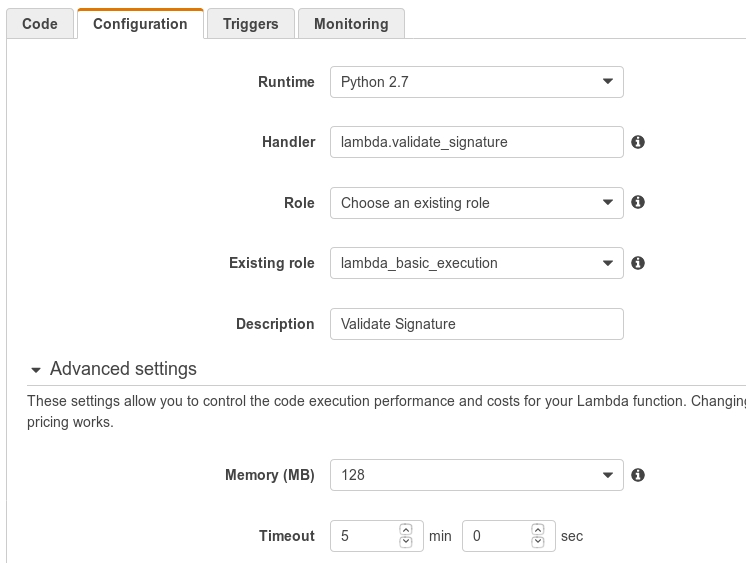

Usage
=====

How do I use this project?
--------------------------

1. Build a zip or use `the one from the last release <https://github.com/mozilla-services/amo2kinto-lambda/releases>`_
2. Upload the zip in a S3 bucket
3. Copy the S3 zip URL
4. Create a the Amazon Lambda function you need and paste the S3 zip URL
5. Configure a Cloud Watch alert that sends an email in case of error

How do I build the last version of the zip?
-------------------------------------------

.. note::
   You need to run this project on a ``x86_64`` linux architecture. 
   
   It's highly recommended to use Lambda's execution environment and work within a Lambda AMI. 
   See http://docs.aws.amazon.com/lambda/latest/dg/current-supported-versions.html

To build the zip run: ``make zip``

It will create a ``lambda.zip`` file ready to use.

You can upload it in a S3 bucket to then access it from Amazon Lambda.

How do I run the ``blockpages-generator`` function on Amazon Lambda?
--------------------------------------------------------------------

Once your function has been configured, you can run it.

To do that, select the function and in the **Actions** menu select
**Configure Test event**.

You will then be able to enter a **Input test event** as a JSON.

.. image:: images/blockpages-generator-test-event.png
    :align: center

This function reads data from kinto and write it to a S3 bucket.

The ``blockpages-generator`` let you define the following inputs:

Settings related to the Kinto server
::::::::::::::::::::::::::::::::::::

- **server**: The Kinto server to read blocklists data from.
- **bucket**: The Kinto bucket where blocklists are stored. default: *blocklists*
- **addons-collection**: The Kinto addons collection name. default: *addons*
- **plugins-collection**: The Kinto plugins collection name. default: *plugins*

If omitted the parameters will take their default value.

Settings related to the S3 bucket
:::::::::::::::::::::::::::::::::

- **aws_region**: The AWS region for the S3 bucket. default: *eu-central-1*
- **bucket_name**: The S3 bucket name. default: *amo-blocked-pages*

.. code-block:: json

    {
      "server": "https://kinto-reader.dev.mozaws.net/v1",
      "aws_region": "eu-central-1",
      "bucket_name": "amo-blocked-pages"
    }

How do I create the ``validate_signature`` function on Amazon Lambda?
---------------------------------------------------------------------

1. `Log into the Amazon Web Service console. <https://console.aws.amazon.com/lambda/home>`_
2. Click the **Create a Lambda Function** button
3. Skip the blueprint
4. Configure the function: **name**, **description**
5. Select **Python 3.6** runtime
6. Select **Upload a file from Amazon S3**
7. Enter your S3 ``lambda.zip`` URL
8. Use **aws_lambda.validate_signature** handler
9. Set a **Lambda S3 Exec Role**
10. Configure a 5 minutes timeout
11. You can proceed without a VPC

How do I run the ``validate_signature`` function on Amazon Lambda?
------------------------------------------------------------------

Once your function has been configured, you can run it.

To do that, select the function and in the **Actions** menu select
**Configure Test event**.

You will then be able to enter a **Input test event** as a JSON.

This function reads the content and signature of a collection and
validate the signature is valid.

The ``validate_signature`` let you define the following inputs:

Settings related to the Kinto server
::::::::::::::::::::::::::::::::::::

- **server**: The Kinto server to read blocklists data from.
- **collections**: The list of collections to validate.

.. code-block:: json

    {
      "server": "https://kinto.stage.mozaws.net/v1",
      "collections": [
        {
          "bucket": "blocklists",
          "collection": "certificates"
        },
        {
          "bucket": "blocklists",
          "collection": "addons"
        },
        {
          "bucket": "blocklists",
          "collection": "plugins"
        },
        {
          "bucket": "blocklists",
          "collection": "gfx"
        },
        {
          "bucket": "pinning",
          "collection": "pins"
        }
      ]
    }
